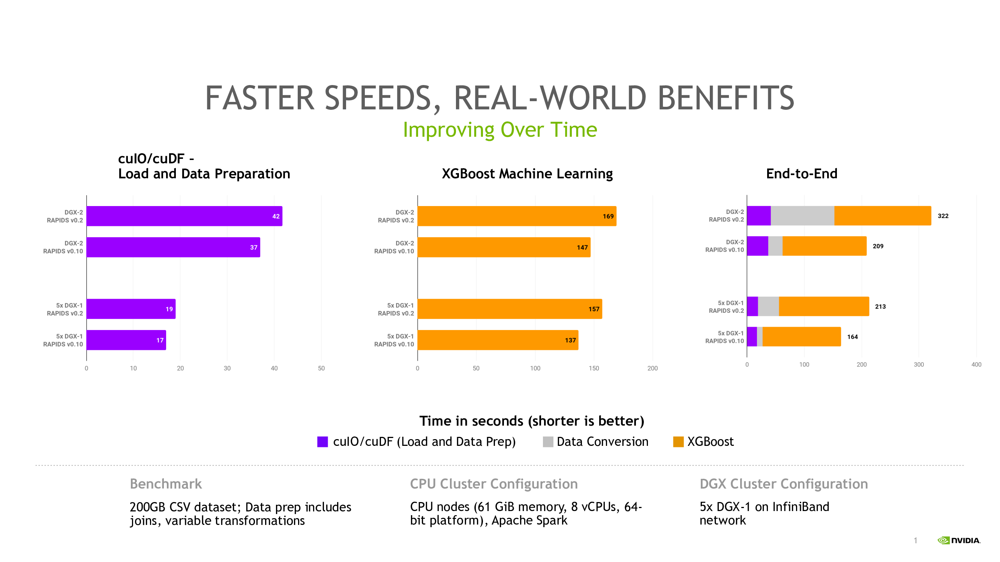
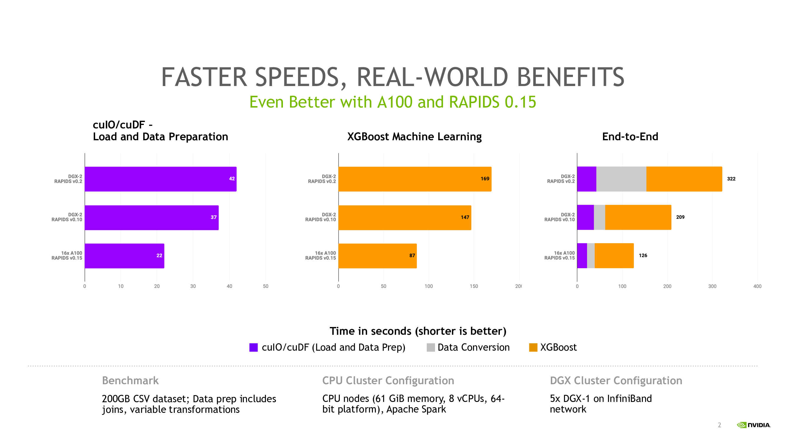

# Mortgage Workflow

## The Dataset
The dataset used with this workflow is derived from [Fannie Mae’s Single-Family Loan Performance Data](http://www.fanniemae.com/portal/funding-the-market/data/loan-performance-data.html) with all rights reserved by Fannie Mae. This processed dataset is redistributed with permission and consent from Fannie Mae.

To acquire this dataset, please visit [RAPIDS Datasets Homepage](https://docs.rapids.ai/datasets/mortgage-data)

## Introduction
The Mortgage workflow is composed of three core phases:

1. ETL - Extract, Transform, Load
2. Data Conversion
3. ML - Training

### ETL
Data is 
1. Read in from storage
2. Transformed to emphasize key features
3. Loaded into volatile memory for conversion

### Data Conversion
Features are
1. Broken into (labels, data) pairs
2. Distributed across many workers
3. Converted into compressed sparse row (CSR) matrix format for XGBoost

### Machine Learning
The CSR data is fed into a distributed training session with `xgboost.dask`

## Performance
We regularly benchmark RAPIDS on this workload to measure our performance against not just Apache Spark on CPUs but past versions of RAPIDS.

